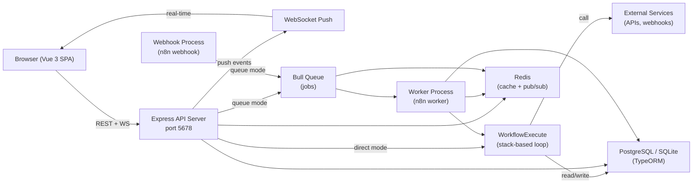
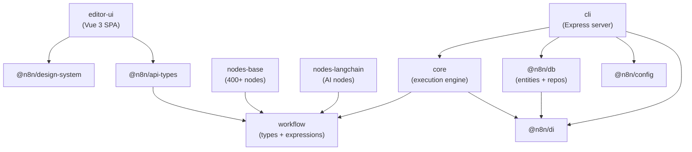
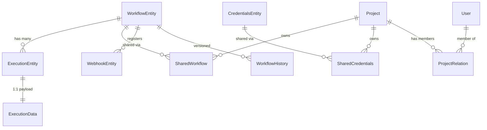
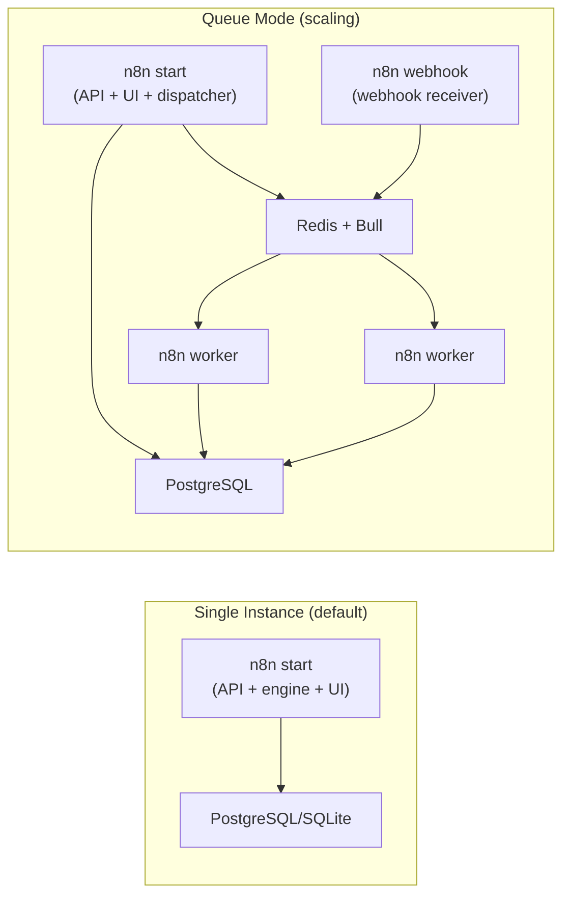

# n8n — Architecture Document

> Auto-generated by reverse-architect. Source: `/Users/ib/prj-other/n0n/n8n`. Date: 2026-02-27.
> Detail files: [./details/](./details/) | UI reference: [./ui-reference/](./ui-reference/)

---

## 1. Executive Summary

n8n is a workflow automation platform that lets technical teams build automations visually by connecting nodes on a canvas. It supports 400+ integrations, native AI/LangChain capabilities, and can be self-hosted or run in the cloud. The system is a TypeScript monorepo (~55 packages) with a Node.js/Express backend, Vue 3 frontend, and a stack-based workflow execution engine backed by PostgreSQL/SQLite and optional Redis/Bull queue scaling.

---

## 2. System Overview

The system has three process types: **main** (API + UI + optional direct execution), **worker** (queue job processor), and **webhook** (dedicated webhook receiver). In single-instance mode, the main process does everything. In scaling mode, Redis + Bull coordinate work distribution, and leader election determines which main instance runs exclusive tasks (trigger activation, queue recovery, execution pruning).

-> Full analysis: [details/01-entry-points.md](./details/01-entry-points.md)

---

## 3. Technology Stack

| Layer | Technology | Version | Role |
|-------|-----------|---------|------|
| Runtime | Node.js | >=22.16 | Server runtime |
| HTTP | Express | 5.1.0 | REST API, webhook server |
| ORM | @n8n/typeorm (fork) | 0.3.20-16 | DB abstraction, migrations |
| Database | PostgreSQL / SQLite | pg 8.17 / sqlite3 5.1 | Primary persistence |
| Queue | Bull (patched) | 4.16.4 | Job queue for scaling |
| Cache/PubSub | Redis (ioredis) | 5.3.2 | Cache, pub/sub, queue backend |
| Frontend | Vue 3 | 3.5.13 | SPA framework |
| State | Pinia | 2.2.4 | Store management |
| Canvas | Vue Flow | 1.48.0 | Workflow graph editor |
| UI Library | Element Plus (patched) | 2.4.3 | Component library |
| Build | Vite (rolldown) | 7.3.1 | Frontend bundling |
| Monorepo | pnpm + Turbo | pnpm 10.22, turbo 2.8.9 | Workspace management |
| Expressions | @n8n/tournament | internal | AST-based expression evaluator |
| AI | LangChain | @langchain/core | AI agent workflows |
| DI | @n8n/di | internal | IoC container |
| Validation | Zod | 3.25.67 | Schema validation |
| Linting | Biome + ESLint | 1.9.0 / 9.29.0 | Code quality |
| Testing | Jest + Vitest + Playwright | 29.6 / 3.1 / 1.58 | Unit, integration, E2E |

-> Full analysis: [details/11-dependencies.md](./details/11-dependencies.md)

---

## 4. Monorepo / Package Structure

55+ packages organized as:

| Group | Key Packages | Purpose |
|-------|-------------|---------|
| Core types | `workflow` | Node interfaces, expression engine, data types |
| Engine | `core` | WorkflowExecute, node loading, credential helpers |
| Server | `cli` | Express server, controllers, services, commands |
| Database | `@n8n/db` | TypeORM entities, repositories, migrations |
| Nodes | `nodes-base`, `@n8n/nodes-langchain` | 400+ built-in integrations + AI nodes |
| Frontend | `editor-ui` | Vue 3 SPA (canvas, NDV, stores) |
| Design | `@n8n/design-system` | Vue component library |
| Config | `@n8n/config` | Centralized typed configuration |
| DI | `@n8n/di` | Dependency injection container |
| API Types | `@n8n/api-types` | Shared FE/BE TypeScript interfaces |
| AI | `@n8n/ai-workflow-builder.ee` | AI workflow generation |
| Infrastructure | `@n8n/task-runner` | External code execution sandbox |

-> Full analysis: [details/01-entry-points.md](./details/01-entry-points.md)

---

## 5. Core Domain Model

Key entities (54 total, TypeORM):

| Entity | Table | Purpose |
|--------|-------|---------|
| **WorkflowEntity** | `workflow_entity` | Workflow graph (nodes + connections as JSON), activation state, version tracking |
| **ExecutionEntity** | `execution_entity` | Execution metadata (status, timing, mode) — lightweight for list queries |
| **ExecutionData** | `execution_data` | Heavy execution payload (run data, result data) — split from entity for performance |
| **CredentialsEntity** | `credentials_entity` | AES-256 encrypted credential data, type, name |
| **User** | `user` | Authentication, profile, MFA |
| **Project** | `project` | Resource ownership scope (personal or team) |
| **SharedWorkflow/SharedCredentials** | junction tables | RBAC: who can access which workflow/credential within a project |
| **WebhookEntity** | `webhook_entity` | Registered production webhook paths |
| **WorkflowHistory** | `workflow_history` | Version snapshots on every save |
| **TagEntity/Folder** | `tag_entity`, `folder` | Organization: tags and hierarchical folders |

The database supports both SQLite (WAL mode, for dev/single-instance) and PostgreSQL (recommended for production). Migrations are the sole schema authority — `synchronize: false`. Entity IDs are NanoID strings.

-> Full schema: [details/02-data-model.md](./details/02-data-model.md)

---

## 6. Execution Engine

Workflows execute via a **stack-based loop** in `WorkflowExecute`. The engine maintains a `nodeExecutionStack` — an array of pending node executions. Each iteration pops one item, runs the node, and pushes downstream nodes onto the stack.

**Execution flow:**
1. **Trigger** — manual click, webhook, schedule, or queue job starts execution
2. **Register** — `ActiveExecutions.add()` creates DB record with `status: 'new'`, reserves concurrency slot
3. **Build** — `Workflow` object pre-computes connection maps (source→dest, dest→source)
4. **Stack init** — Start node pushed with initial data `[{json: {}}]`
5. **Loop** — Pop node from stack → resolve expressions → run node → push downstream nodes
6. **Multi-input** — Merge-type nodes wait in `waitingExecution` until all input ports have data
7. **Complete** — Stack empty → save results → push completion event to UI

**State machine:** `new → running → success | error | canceled | waiting`

Special mechanisms: pinned data bypasses execution, Wait nodes suspend to DB and resume via `WaitTracker` (60s poll), sub-workflows create nested `WorkflowExecute` instances, partial re-runs compute minimal dirty subgraph.

-> Full analysis: [details/04-execution-engine.md](./details/04-execution-engine.md)

---

## 7. Node / Plugin System

Every node implements `INodeType` with a required `description: INodeTypeDescription` and one execution method:

| Method | Use Case |
|--------|----------|
| `execute()` | Standard data processing (HTTP Request, Set, Code, etc.) |
| `trigger()` | Long-lived connections (MQTT, RabbitMQ) |
| `poll()` | Periodic checks (Gmail Trigger, RSS) |
| `webhook()` | HTTP endpoint handlers |
| `supplyData()` | AI sub-nodes (LLM, memory, tools) |

**18 parameter types** control the UI: `string`, `number`, `boolean`, `options`, `collection`, `fixedCollection`, `json`, `resourceLocator`, `resourceMapper`, `filter`, `assignmentCollection`, etc.

**Discovery:** Nodes are found via the `n8n.nodes` array in `package.json`, loaded lazily from pre-built JSON manifests. Community nodes install as npm packages and register through the same mechanism.

**Versioning:** Two strategies — light (single class, `version: [1, 1.1]`, conditional `displayOptions`) and full (`VersionedNodeType` with a version→class map).

**Declarative nodes** skip `execute()` entirely; the `RoutingNode` class translates `description.requestDefaults` and per-operation `routing` config into HTTP calls automatically.

-> Full contract: [details/05-node-system.md](./details/05-node-system.md)

---

## 8. Trigger System

| Type | Mechanism | Persistence |
|------|-----------|------------|
| Manual | `ManualTrigger.trigger()` — emits `[{}]` immediately | None (editor only) |
| Schedule/Cron | `ScheduleTrigger` + `cron` library via `ScheduledTaskManager` | In-memory on leader |
| Webhook (prod) | DB-registered paths, served by `LiveWebhooks` | `webhook_entity` table |
| Webhook (test) | Ephemeral Redis cache, 2-min TTL, served by `TestWebhooks` | Redis (temporary) |
| Polling | Nodes with `poll()`, cron-scheduled | In-memory on leader |
| Event-based | Nodes with `trigger()`, long-lived connections | In-memory on leader |
| Wait resume | HTTP to `/webhook-waiting/:executionId` | DB (execution data) |

Key architectural rule: DB-registered webhooks can be served from any process; in-memory triggers/pollers run only on the leader instance.

-> Full analysis: [details/10-triggers-webhooks.md](./details/10-triggers-webhooks.md)

---

## 9. API Reference

Three API surfaces:

1. **Internal REST API** (~50+ endpoints) — session-based JWT auth, Controller-Service-Repository pattern with `@n8n/di`. Resource groups: auth, users, workflows, executions, credentials, projects, tags, folders, settings, OAuth, community nodes, insights.

2. **Public API** — OpenAPI-compliant, API key auth (Bearer token). Versioned (`/api/v1/`). Subset of internal API for external integrations.

3. **WebSocket Push** — Bidirectional real-time channel. Events include: `executionStarted`, `executionFinished`, `nodeExecuteBefore`, `nodeExecuteAfter`, `workflowActivated`, `collaboratorsChanged`, `writeLockAcquired`. Transport: WebSocket (default, 30s heartbeat) or SSE fallback.

**Middleware stack** (order): Helmet → compression → raw body → cookie parser → CORS → webhook routes (before body parser) → health check → auth → rate limiting → scopes → body parsing → error handling.

-> Full reference: [details/03-api-surface.md](./details/03-api-surface.md)

---

## 10. Frontend Architecture

### Canvas Editor
Built on **Vue Flow** (`@vue-flow/core`). Component hierarchy: `NodeView` → `WorkflowCanvas` → `Canvas` (VueFlow host) → `CanvasNode`/`CanvasEdge` (custom types).

The critical bridge is `useCanvasMapping` composable — it reactively transforms `INodeUi[]` + `IConnections` (legacy name-indexed format) into VueFlow nodes and edges. Node positions are absolute pixel coordinates. Layout uses **Dagre** (LR direction, 16px grid snapping).

Execution visualization: running nodes get an animated conic-gradient border (1.5s cycle), successful edges turn green with item count labels.

### State Management
**50+ Pinia stores** (Composition API style). Key stores:
- `useRootStore` — API base URL, `pushRef` (tab ID)
- `useWorkflowsStore` — current workflow + execution data (~65KB, largest store)
- `usePushConnectionStore` — WebSocket lifecycle, message fan-out to handlers
- `useUIStore` — modal states, theme, dirty flags
- `useCollaborationStore` — multi-user write-lock

API client: Axios via `makeRestApiRequest()`, cookie-based auth, every request carries `push-ref` and `browser-id` headers.

-> Canvas details: [details/06-frontend-canvas.md](./details/06-frontend-canvas.md)
-> State details: [details/07-frontend-state.md](./details/07-frontend-state.md)

---

## 11. Credential & Expression System

### Expressions
Parameters starting with `=` are expressions. The `@n8n/tournament` package — an AST-based evaluator (not `eval`) — parses and evaluates them against a rich context: `$json`, `$input`, `$node`, `$execution`, `$env`, etc.

Security: AST hooks (`ThisSanitizer`, `PrototypeSanitizer`, `DollarSignValidator`) plus runtime denylisting of `eval`, `Function`, `Promise`, `Proxy`, etc. Runs in-process (same V8 context), not in a true isolate.

### Credentials
AES-256-CBC encryption with per-record random salt. Master key stored in `~/.n8n/config` (or `N8N_ENCRYPTION_KEY` env var). At runtime, nodes call `this.getCredentials('typeId')` — the engine loads from DB, decrypts, resolves expressions within credential values, and returns plain objects.

OAuth 1/2 flows are handled by `OAuthService` with encrypted CSRF state. Token refresh happens via `preAuthentication` hooks on the credential type.

-> Full analysis: [details/09-expressions-credentials.md](./details/09-expressions-credentials.md)

---

## 12. Scaling & High Availability

**Queue:** Single Bull queue named `jobs`. Webhook-triggered jobs get priority 50 (faster), scheduled get 100. `maxStalledCount = 0` — no automatic retry. Jobs removed from Redis on completion/failure.

**Leader election (multi-main):** Redis key `{prefix}:main_instance_leader` with `SET NX EX` + 3s TTL renewal. Leader runs: queue recovery (every 3h), wait-tracking, execution pruning, trigger activation.

**Push relay:** Workers send node events via `job.progress()` (Bull internal pub/sub). Main receives on `global:progress` and relays via Redis pub/sub. Only the main holding the browser's `pushRef` sends the WebSocket frame.

**Redis usage:** 6 ioredis clients per process (3 for n8n pub/sub/cache, 3 for Bull subscriber/client/bclient).

-> Full analysis: [details/08-queue-scaling.md](./details/08-queue-scaling.md)

---

## 13. Configuration Reference

Key environment variables:

| Variable | Default | Purpose |
|----------|---------|---------|
| `N8N_PORT` | 5678 | Server listen port |
| `N8N_LISTEN_ADDRESS` | `[::]` | Bind address |
| `EXECUTIONS_MODE` | `regular` | `regular` (in-process) or `queue` (Redis) |
| `DB_TYPE` | `sqlite` | `sqlite` or `postgresdb` |
| `DB_POSTGRESDB_*` | — | PostgreSQL connection params |
| `N8N_ENCRYPTION_KEY` | auto-generated | Master key for credential encryption |
| `QUEUE_BULL_REDIS_*` | — | Redis connection for Bull queue |
| `N8N_CONCURRENCY_PRODUCTION_LIMIT` | -1 | Max concurrent executions (main process) |
| `N8N_GRACEFUL_SHUTDOWN_TIMEOUT` | 30 | Seconds to wait for running executions on shutdown |
| `N8N_ENDPOINT_WEBHOOK` | `/webhook` | Production webhook URL prefix |

-> Full reference: [details/01-entry-points.md](./details/01-entry-points.md)

---

## 14. UI & UX Reference

30 screenshots captured across all key screens. Design highlights:

| Token | Value | Usage |
|-------|-------|-------|
| Primary (orange) | `hsl(7, 100%, 68%)` | Buttons, active states, links, node borders |
| Secondary (purple) | `hsl(247, 49%, 53%)` | Expression editor, pinned data, focus rings |
| Success (green) | `hsl(147, 60%, 40%)` | Successful execution borders |
| Font | InterVariable, sans-serif | All UI text |
| Border radius | 4px default, 8px large | Cards, buttons, modals |
| Spacing scale | 2, 4, 6, 8, 12, 16, 20, 24, 32, 48, 64px | 4px base unit |

**Key UX patterns:**
1. **3-panel NDV** — Input | Parameters | Output shown simultaneously in a full-width overlay
2. **Right-panel node picker** — slides in from right, canvas stays visible, categories then drill-down
3. **Execution state on canvas** — colored borders + item count badges directly on nodes/edges
4. **Collapsible sidebar** — 42px collapsed (icon-only) / 200px expanded
5. **Orange as sole brand color** — all interactive elements route through orange or gray

-> Full reference: [ui-reference/UI_REFERENCE.md](./ui-reference/UI_REFERENCE.md)

---

## 15. Key Patterns & Conventions

1. **Controller-Service-Repository** — Backend follows MVC-like layering with `@n8n/di` IoC container. Controllers handle HTTP, services contain business logic, repositories wrap TypeORM.

2. **Connections indexed by source node name** — The canonical wire format `IConnections` maps `sourceName → { main: [[{node, type, index}]] }`. Inverted maps are computed on demand via `mapConnectionsByDestination()`.

3. **Expression resolution is transparent to nodes** — Nodes receive already-resolved parameter values. The engine resolves expressions before calling `execute()`.

4. **Declarative node pattern** — Nodes without `execute()` are handled by `RoutingNode`, which translates `description.routing` config into HTTP calls. This covers a large portion of REST API integrations.

5. **Split execution data** — `ExecutionEntity` (metadata) and `ExecutionData` (payload) are separate tables to keep list queries fast.

6. **Push via WebSocket with SSE fallback** — Real-time updates use `pushRef` (per-tab unique ID) for targeted delivery. In HA mode, Redis pub/sub relays between processes.

7. **Leader-only tasks** — Trigger activation, queue recovery, and execution pruning run only on the elected leader (Redis-based election with 3s TTL).

8. **Lazy node loading** — Node types are discovered from `package.json` manifests but only imported on first use, keeping startup fast.

9. **Credential encryption at rest** — AES-256-CBC with per-record salt. Master key in `~/.n8n/config` or env var. Decryption happens just-in-time during execution.

10. **Frontend reactive mapping** — `useCanvasMapping` composable bridges workflow JSON to Vue Flow graph data reactively. All canvas state derives from Pinia stores.

11. **Version-locked nodes** — Workflow JSON stores `typeVersion`. The engine loads the exact version used when the workflow was saved, ensuring backward compatibility.

12. **Webhook URL stability** — Nodes have a `webhookId` (UUID) that persists across renames, keeping external webhook URLs stable.

---

## 16. Rebuild Roadmap

Ordered build sequence for reconstructing a compatible system:

1. **Data model + DB layer** — TypeORM entities, migrations, repository pattern
   -> Read: [02-data-model.md](./details/02-data-model.md)

2. **Core execution engine** — Stack-based loop, `IRunExecutionData`, node dispatch, multi-input waiting
   -> Read: [04-execution-engine.md](./details/04-execution-engine.md)

3. **Expression engine** — AST-based evaluator, context variables (`$json`, `$input`, etc.), security hooks
   -> Read: [09-expressions-credentials.md](./details/09-expressions-credentials.md)

4. **Node system + built-in nodes** — `INodeType` interface, parameter types, declarative routing, node discovery
   -> Read: [05-node-system.md](./details/05-node-system.md)

5. **Credential system** — AES encryption, credential types, OAuth flows, just-in-time injection
   -> Read: [09-expressions-credentials.md](./details/09-expressions-credentials.md)

6. **Queue + worker infrastructure** — Bull queue, job producer/consumer, leader election, graceful shutdown
   -> Read: [08-queue-scaling.md](./details/08-queue-scaling.md)

7. **REST API + WebSocket server** — Express controllers, auth (JWT sessions + API keys), push channel
   -> Read: [03-api-surface.md](./details/03-api-surface.md), [01-entry-points.md](./details/01-entry-points.md)

8. **Trigger system + webhook server** — Webhook registration, schedule/cron, polling, test vs production webhooks
   -> Read: [10-triggers-webhooks.md](./details/10-triggers-webhooks.md)

9. **Frontend canvas + state** — Vue Flow integration, Pinia stores, real-time push handlers, NDV
   -> Read: [06-frontend-canvas.md](./details/06-frontend-canvas.md), [07-frontend-state.md](./details/07-frontend-state.md)

10. **UI polish** — Design tokens, component library, responsive layout
    -> Read: [ui-reference/UI_REFERENCE.md](./ui-reference/UI_REFERENCE.md)

---

## 17. What to Improve

1. **Expression sandbox is not a true isolate.** The `@n8n/tournament` evaluator runs in the same Node.js V8 context. AST hooks mitigate the risk, but a determined attacker with code execution (e.g., via the Code node) could potentially escape. The `@n8n/expression-runtime` package describes a future `isolated-vm` approach but it's not wired into production.

2. **Monolithic CLI package.** `packages/cli` is the largest package by far — it contains the Express server, all controllers, all services, all commands, the scaling layer, and the webhook server. This makes it hard to test in isolation and creates long build times. A further decomposition into server, scaling, and command packages would improve maintainability.

3. **TypeORM fork maintenance burden.** The vendored `@n8n/typeorm` fork requires ongoing patch maintenance against upstream TypeORM. Each upstream security fix or feature must be manually cherry-picked. Migration to a lighter ORM (Drizzle, Kysely) would reduce this burden but is a massive undertaking given 54+ entities.

4. **Single Bull queue for all workloads.** All executions share one `jobs` queue with only two priority levels (50 for webhooks, 100 for scheduled). There's no workload isolation — a flood of scheduled executions can delay webhook-triggered ones. Separate queues per priority class would improve latency guarantees.

5. **Frontend store coupling.** The 50+ Pinia stores have significant cross-references (stores importing and calling other stores). The `useWorkflowsStore` at ~65KB is a particularly large unit. Decomposing it and establishing clearer store boundaries would improve testability and reduce cognitive load.

---

## 18. Node Compatibility Analysis

Can n0n reuse n8n's 400+ node integrations? **Yes — 95% of nodes import only from `n8n-workflow` (a pure TS package with zero server dependencies).** The real challenge is implementing the ~80-method `IExecuteFunctions` execution context that nodes receive as `this`.

Key findings:
- Nodes are simple classes — the complexity is in the injected context
- Only the Code node has server coupling (`@n8n/di`, `@n8n/config`) — all others are clean
- Declarative/routing nodes (~20% of catalog) require porting the `RoutingNode` class (~600 lines)
- The expression system lives entirely in `n8n-workflow` — zero reimplementation needed
- Community nodes use the same mechanism and are loadable with a ~100-line loader

**Phased plan:** Phase 1 (4-6 weeks) covers top 20 nodes with 8 context methods. Phase 2 (2-3 months) reaches 200+ nodes. Phase 3 (1-2 months) achieves full ecosystem compatibility.

-> Full analysis: [details/node-compatibility-analysis.md](./details/node-compatibility-analysis.md)

---

## 19. n0n Technology Stack Research

Deep research (Perplexity, Feb 2026) into the latest replacement technologies for each architectural layer. Each area was evaluated against n8n's choices and n0n's Bun + React constraints.

### Stack Decision Summary

| Layer | n8n Choice | n0n Choice | Verdict | Key Reason |
|-------|-----------|------------|---------|------------|
| Runtime | Node.js >=22 | **Bun** | Switch | 2-3x faster, native TS, built-in test runner |
| HTTP Framework | Express 5.1 | **Elysia 1.4** | Switch | 2.5x faster than Hono on Bun, type-first, native WS |
| ORM | TypeORM (fork) | **Drizzle ORM** | Switch | 200x smaller bundle, SQL-first, no codegen, Bun-native |
| Database | PostgreSQL + SQLite | **PostgreSQL** (via postgres.js) | Keep PG, drop SQLite | Simplify to one DB target |
| Queue | Bull | **BullMQ** | Switch | Strictly better API, TypeScript-native, same Redis backend |
| Frontend Framework | Vue 3 | **React 19** | Switch | Team preference, larger ecosystem |
| Canvas Editor | Vue Flow | **React Flow 12** (@xyflow/react) | Switch | Same library, React port. 35K stars, best-in-class |
| State Management | Pinia (50+ stores) | **Zustand** + **TanStack Query** | Switch | Zustand for UI state, TQ for server state cache |
| UI Components | Element Plus (patched) | **shadcn/ui** (Radix primitives) | Switch | Copy-paste ownership, no patching, Tailwind |
| Code Editor | CodeMirror 6 | **CodeMirror 6** | Keep | Best size/power ratio, custom Lezer grammars |
| Expression Engine | @n8n/tournament (AST) | **QuickJS-emscripten** (WASM sandbox) | Switch | True WASM isolation, immune to n8n-style CVEs |
| Routing | Vue Router | **React Router v7** | Switch | Library mode, stable |
| Real-time | Express WS + SSE | **Bun native WebSocket** | Switch | Built into Elysia, zero-dependency |
| Build | Vite + Vue | **Vite + React** | Keep Vite | Fast, mature, React plugin |
| Monorepo | pnpm + Turbo | **Bun workspaces** + Turbo | Partial switch | Bun for runtime, Turbo for build orchestration |

### Detail Files

| Area | File | Recommendation |
|------|------|---------------|
| HTTP Framework | [stack-research-http-framework.md](./details/stack-research-http-framework.md) | **Elysia** — 1.84M req/s, type-first, native WS pub/sub |
| Canvas Editor | [stack-research-canvas-editor.md](./details/stack-research-canvas-editor.md) | **React Flow 12** — unchallenged leader, 4.8M weekly downloads |
| ORM / Database | [stack-research-orm-database.md](./details/stack-research-orm-database.md) | **Drizzle** — 7.4KB bundle, SQL-first, typed JSONB columns |
| Job Queue | [stack-research-job-queue.md](./details/stack-research-job-queue.md) | **BullMQ** — mature, distributed, every feature needed |
| Frontend Stack | [stack-research-frontend-stack.md](./details/stack-research-frontend-stack.md) | **Zustand + TanStack Query + shadcn/ui + CodeMirror 6** |
| Expression Sandbox | [stack-research-expression-sandbox.md](./details/stack-research-expression-sandbox.md) | **QuickJS-emscripten** — WASM isolation, 100-300us/eval |

### Key Deltas from n8n

The most impactful technology changes vs n8n:

1. **Drizzle over TypeORM** — Eliminates the forked ORM maintenance burden. SQL-first design with typed JSONB columns is ideal for storing workflow definitions. 200x smaller bundle means faster cold starts.

2. **QuickJS-emscripten over AST hooks** — Moves expression evaluation from "sanitized same-process eval" to "true WASM sandbox." Structurally immune to the class of sandbox escapes that affect n8n (CVE-2026-1470, CVE-2026-0863). Layered with jsep fast-path for simple property access.

3. **TanStack Query for server state** — Splits the 65KB `workflowsStore` problem. Server-fetched data (workflow lists, execution history, node types) moves to TQ with automatic cache invalidation via WebSocket events. Zustand handles only pure UI state (modals, selection, theme).

4. **Elysia's type-first design** — Auto-generates OpenAPI from route definitions. End-to-end type safety from route → handler → response without separate DTO files. Eden Treaty provides typed client generation for the frontend.
