# n8n Data Model

Complete mapping of every persisted entity, field, relationship, and persistence strategy
for the n8n workflow automation platform.

---

## Persistence Strategy

### ORM
TypeORM (`@n8n/typeorm`, a vendored fork) with two supported backends:

- **SQLite** (pooled, WAL mode) — default for self-hosted single instances
- **PostgreSQL** — recommended for production and queue-mode deployments

Configuration: `/Users/ib/prj-other/n0n/n8n/packages/@n8n/db/src/connection/db-connection-options.ts:17`

- `synchronize: false` — schema is managed exclusively through migrations
- `migrationsRun: false` — migrations are triggered explicitly at startup via `dbConnection.migrate()`
- Each migration runs in its own transaction (`transaction: 'each'`)
- Table prefix is configurable via `N8N_DB_TABLE_PREFIX`
- Connection pooling: `poolSize` config for both SQLite (`sqlite-pooled` driver) and Postgres
- Postgres pool idle timeout and statement timeout are configurable

### Migration System
Common migrations shared between SQLite and Postgres live in:
`/Users/ib/prj-other/n0n/n8n/packages/@n8n/db/src/migrations/common/`

Earliest migration timestamp: `1620821879465` (UniqueWorkflowNames, 2021)
Latest migration timestamp (visible): `1770000000000` (CreateChatHubToolsTable)

The migration list shows a clear evolution:
- 2021: Basic workflow/credential uniqueness constraints
- 2023: Projects, soft-delete for executions, workflow history
- 2024: Execution annotations, API keys, processed data, test definitions
- 2025: Insights/analytics, roles/scopes RBAC overhaul, chat hub, binary data table, OAuth MCP, workflow dependency index, data tables, workflow publish history

### Caching Layer
`/Users/ib/prj-other/n0n/n8n/packages/cli/src/services/cache/cache.service.ts:24`

Two backends, selected at runtime:
- **In-memory** (`cache-manager` memory store) — used in single-instance mode
- **Redis** (`ioredis`) — used when `executions.mode === 'queue'` or explicitly configured

Cache uses key prefixes: `{n8n:cache}:<key>` with Redis hash-tag support for cluster mode.
Cache stores: credentials, webhooks, roles, ownership lookups — primarily hot-path read data.

### Module-Registered Entities
Community-package and module-level entities (ChatHub, MCP, DataTable, WorkflowBuilder) are
registered dynamically via `moduleRegistry.entities` at connection time:
`/Users/ib/prj-other/n0n/n8n/packages/@n8n/db/src/connection/db-connection-options.ts:61`

---

## Abstract Base Classes

All entities inherit from mixins defined in:
`/Users/ib/prj-other/n0n/n8n/packages/@n8n/db/src/entities/abstract-entity.ts:1`

| Mixin | Fields Added |
|---|---|
| `WithStringId` | `id: string` (NanoID, varchar PK, auto-generated on insert) |
| `WithCreatedAt` | `createdAt: Date` (auto, precision 3) |
| `WithUpdatedAt` | `updatedAt: Date` (auto, precision 3) |
| `WithTimestamps` | `createdAt` + `updatedAt` |
| `WithTimestampsAndStringId` | `id` + `createdAt` + `updatedAt` |

Column type selection is DB-aware:
- JSON: `simple-json` (SQLite) / `json` (Postgres)
- Datetime: `datetime` (SQLite) / `timestamptz` (Postgres)
- Binary: `blob` (SQLite) / `bytea` (Postgres)

---

## Entity Catalog

### 1. WorkflowEntity
**Table:** `workflow_entity`
**File:** `/Users/ib/prj-other/n0n/n8n/packages/@n8n/db/src/entities/workflow-entity.ts:26`
**Inherits:** `WithTimestampsAndStringId` (NanoID string PK)

Represents a saved automation workflow.

| Field | Type | Constraints | Notes |
|---|---|---|---|
| `id` | varchar | PK, NanoID | Inherited |
| `name` | varchar(128) | NOT NULL, UNIQUE INDEX | Workflow display name |
| `description` | text | nullable | Added migration 1762177736257 |
| `active` | boolean | NOT NULL | Deprecated; prefer `activeVersionId IS NOT NULL` |
| `isArchived` | boolean | default false | Soft-delete: archived workflows cannot be activated or modified |
| `nodes` | json | NOT NULL | Array of `INode` objects (full node definitions) |
| `connections` | json | NOT NULL | `IConnections` map — indexed by source node name |
| `settings` | json | nullable | `IWorkflowSettings` (timeout, error workflow, timezone, etc.) |
| `staticData` | json | nullable | Persistent data across executions (stored per workflow) |
| `meta` | json | nullable | `WorkflowFEMeta` — frontend metadata |
| `pinData` | json | nullable | `ISimplifiedPinData` — test data pinned per node |
| `versionId` | varchar(36) | NOT NULL | UUID changed on every save (optimistic locking) |
| `activeVersionId` | varchar(36) | nullable | FK → `workflow_history.versionId`; non-null means workflow is active |
| `versionCounter` | int | default 1 | Incrementing counter for change tracking |
| `triggerCount` | int | default 0 | Count of active trigger nodes (billing metric) |
| `parentFolderId` | varchar | nullable, FK | → `folder.id` ON DELETE CASCADE |
| `createdAt` | timestamptz | NOT NULL | Inherited |
| `updatedAt` | timestamptz | NOT NULL | Inherited |

**Relationships:**
- M:M → `TagEntity` via `workflows_tags` junction table
- O:M → `SharedWorkflow` (project access records)
- O:M → `WorkflowTagMapping` (explicit junction for tag counts)
- O:M → `WorkflowHistory` (version snapshots)
- M:1 → `WorkflowHistory` via `activeVersionId` (currently active version)
- M:1 → `Folder` via `parentFolderId`
- O:M → `TestRun`

---

### 2. ExecutionEntity
**Table:** `execution_entity`
**File:** `/Users/ib/prj-other/n0n/n8n/packages/@n8n/db/src/entities/execution-entity.ts:31`
**PK:** Auto-generated integer, stringified on read

Represents a single workflow execution run.

| Field | Type | Constraints | Notes |
|---|---|---|---|
| `id` | int (stringified) | PK, auto-increment | Numeric ID exposed as string |
| `finished` | boolean | NOT NULL | Deprecated; use `status` |
| `mode` | varchar | NOT NULL | `WorkflowExecuteMode`: manual, trigger, webhook, retry, etc. |
| `retryOf` | varchar | nullable | ID of execution this retries |
| `retrySuccessId` | varchar | nullable | ID of successful retry (if any) |
| `status` | varchar | NOT NULL | `ExecutionStatus`: waiting, running, success, error, canceled |
| `createdAt` | datetime | NOT NULL | Row creation time |
| `startedAt` | datetime | nullable | When processing actually started (null if enqueued but not started) |
| `stoppedAt` | datetime | nullable | INDEX |
| `deletedAt` | datetime | nullable | Soft-delete timestamp (TypeORM `@DeleteDateColumn`) |
| `workflowId` | varchar | nullable | Reference to `workflow_entity.id` (no FK constraint enforced) |
| `waitTill` | datetime | nullable | When a waiting execution should resume |
| `storedAt` | varchar(2) | NOT NULL, default `'db'` | Storage location: `'db'` or `'fs'` |

**Composite Indexes:**
- `(workflowId, id)`
- `(waitTill, id)`
- `(finished, id)`
- `(workflowId, finished, id)`
- `(workflowId, waitTill, id)`

**Relationships:**
- O:1 → `ExecutionData` (full execution payload, cascade delete)
- O:1 → `ExecutionAnnotation` (user vote/note)
- O:M → `ExecutionMetadata` (key-value custom data)
- M:1 → `WorkflowEntity` (lazy, no FK enforced in older records)

---

### 3. ExecutionData
**Table:** `execution_data`
**File:** `/Users/ib/prj-other/n0n/n8n/packages/@n8n/db/src/entities/execution-data.ts:10`
**PK:** `executionId` (shared with `ExecutionEntity`)

Stores the heavy payload of an execution separately for efficient list queries.

| Field | Type | Constraints | Notes |
|---|---|---|---|
| `executionId` | varchar (int stringified) | PK, FK → execution_entity ON DELETE CASCADE | |
| `data` | text | NOT NULL | Serialized `IRunExecutionData` — full node output data |
| `workflowData` | json | NOT NULL | Snapshot of `IWorkflowBase` at execution time |
| `workflowVersionId` | varchar(36) | nullable | Version ID of the workflow snapshot used |

**Relationships:**
- O:1 → `ExecutionEntity` (cascade delete)

---

### 4. ExecutionMetadata
**Table:** `execution_metadata`
**File:** `/Users/ib/prj-other/n0n/n8n/packages/@n8n/db/src/entities/execution-metadata.ts:6`
**PK:** Auto-increment int

Key-value store for custom execution metadata (e.g., custom data attached by nodes).

| Field | Type | Constraints | Notes |
|---|---|---|---|
| `id` | int | PK, auto-increment | |
| `executionId` | varchar | NOT NULL, FK → execution_entity ON DELETE CASCADE | |
| `key` | text | NOT NULL | |
| `value` | text | NOT NULL | |

---

### 5. ExecutionAnnotation
**Table:** `execution_annotations`
**File:** `/Users/ib/prj-other/n0n/n8n/packages/@n8n/db/src/entities/execution-annotation.ee.ts:20`
**PK:** Auto-increment int
**Enterprise Edition**

User-added annotation on an execution.

| Field | Type | Constraints | Notes |
|---|---|---|---|
| `id` | int | PK, auto-increment | |
| `vote` | varchar | nullable | `AnnotationVote`: 'up' or 'down' |
| `note` | varchar | nullable | Free-text note |
| `executionId` | string | UNIQUE INDEX, FK → execution_entity ON DELETE CASCADE | |

**Relationships:**
- O:1 → `ExecutionEntity`
- M:M → `AnnotationTagEntity` via `execution_annotation_tags`
- O:M → `AnnotationTagMapping`

---

### 6. AnnotationTagEntity
**Table:** `annotation_tag_entity`
**File:** `/Users/ib/prj-other/n0n/n8n/packages/@n8n/db/src/entities/annotation-tag-entity.ee.ts:9`
**Inherits:** `WithTimestampsAndStringId`
**Enterprise Edition**

Tags that can be attached to execution annotations (separate from workflow tags).

| Field | Type | Constraints | Notes |
|---|---|---|---|
| `id` | varchar | PK, NanoID | |
| `name` | varchar(24) | UNIQUE INDEX | |
| `createdAt` | timestamptz | | |
| `updatedAt` | timestamptz | | |

**Relationships:**
- M:M → `ExecutionAnnotation` via `execution_annotation_tags`

---

### 7. AnnotationTagMapping
**Table:** `execution_annotation_tags`
**File:** `/Users/ib/prj-other/n0n/n8n/packages/@n8n/db/src/entities/annotation-tag-mapping.ee.ts:10`
**PK:** Composite (`annotationId`, `tagId`)

Junction table for annotations ↔ annotation tags.

| Field | Type | Constraints |
|---|---|---|
| `annotationId` | int | PK, FK → execution_annotations ON DELETE CASCADE |
| `tagId` | varchar | PK, FK → annotation_tag_entity ON DELETE CASCADE |

---

### 8. CredentialsEntity
**Table:** `credentials_entity`
**File:** `/Users/ib/prj-other/n0n/n8n/packages/@n8n/db/src/entities/credentials-entity.ts:9`
**Inherits:** `WithTimestampsAndStringId`

Stored encrypted credentials for third-party service authentication.

| Field | Type | Constraints | Notes |
|---|---|---|---|
| `id` | varchar | PK, NanoID | |
| `name` | varchar(128) | NOT NULL | Display name |
| `data` | text | NOT NULL | Encrypted JSON (AES-256 symmetric, key from `N8N_ENCRYPTION_KEY`) |
| `type` | varchar(128) | NOT NULL, INDEX | Credential type identifier (e.g., `githubApi`, `openAiApi`) |
| `isManaged` | boolean | default false | Managed by n8n (e.g., free OpenAI credits); user cannot edit |
| `isGlobal` | boolean | default false | Available to all users in all projects |
| `isResolvable` | boolean | default false | Dynamic resolution via resolver workflow |
| `resolvableAllowFallback` | boolean | default false | Fall back to static if dynamic resolution fails |
| `resolverId` | varchar | nullable | ID of dynamic credential resolver |
| `createdAt` | timestamptz | | |
| `updatedAt` | timestamptz | | |

**Relationships:**
- O:M → `SharedCredentials` (project-level access grants)

---

### 9. SharedCredentials
**Table:** `shared_credentials`
**File:** `/Users/ib/prj-other/n0n/n8n/packages/@n8n/db/src/entities/shared-credentials.ts:9`
**PK:** Composite (`credentialsId`, `projectId`)
**Inherits:** `WithTimestamps`

Junction table granting a project access to a credential.

| Field | Type | Constraints | Notes |
|---|---|---|---|
| `credentialsId` | varchar | PK, FK → credentials_entity ON DELETE CASCADE | |
| `projectId` | varchar | PK, FK → project ON DELETE CASCADE | |
| `role` | varchar | NOT NULL | `CredentialSharingRole`: `credential:owner` or `credential:user` |
| `createdAt` | timestamptz | | |
| `updatedAt` | timestamptz | | |

---

### 10. User
**Table:** `user`
**File:** `/Users/ib/prj-other/n0n/n8n/packages/@n8n/db/src/entities/user.ts:30`
**PK:** UUID (auto-generated)
**Inherits:** `WithTimestamps`

A person with access to the n8n instance.

| Field | Type | Constraints | Notes |
|---|---|---|---|
| `id` | uuid | PK | |
| `email` | varchar(254) | nullable, UNIQUE INDEX, lowercased | |
| `firstName` | varchar(32) | nullable | |
| `lastName` | varchar(32) | nullable | |
| `password` | varchar | nullable | bcrypt hash; null for SSO-only users |
| `personalizationAnswers` | json | nullable | Onboarding survey responses |
| `settings` | json | nullable | `IUserSettings` — UI preferences |
| `roleSlug` | varchar | FK → role.slug | Global role assignment |
| `disabled` | boolean | default false | |
| `mfaEnabled` | boolean | default false | |
| `mfaSecret` | varchar | nullable | TOTP secret |
| `mfaRecoveryCodes` | simple-array | default `''` | Backup recovery codes |
| `lastActiveAt` | date | nullable | Last login/activity date |
| `createdAt` | timestamptz | | |
| `updatedAt` | timestamptz | | |

**Computed (not persisted):**
- `isPending`: true when `password IS NULL` and no external auth identity and not global owner

**Relationships:**
- M:1 → `Role` via `roleSlug`
- O:M → `AuthIdentity` (SSO provider links)
- O:M → `ApiKey`
- O:M → `SharedWorkflow` (legacy, pre-Projects)
- O:M → `SharedCredentials` (legacy, pre-Projects)
- O:M → `ProjectRelation` (current project membership)

---

### 11. Role
**Table:** `role`
**File:** `/Users/ib/prj-other/n0n/n8n/packages/@n8n/db/src/entities/role.ts:10`
**PK:** `slug` (string)
**Inherits:** `WithTimestamps`

RBAC role definition. Added in migration `1750252139167`.

| Field | Type | Constraints | Notes |
|---|---|---|---|
| `slug` | varchar | PK | e.g., `global:owner`, `project:editor`, `credential:user` |
| `displayName` | varchar | NOT NULL | |
| `description` | varchar | nullable | |
| `systemRole` | boolean | default false | Built-in, cannot be edited |
| `roleType` | varchar | NOT NULL | `'global'` / `'project'` / `'workflow'` / `'credential'` |
| `createdAt` | timestamptz | | |
| `updatedAt` | timestamptz | | |

**Relationships:**
- M:M → `Scope` via `role_scope` junction table (eager-loaded)
- O:M → `ProjectRelation`

**Built-in global roles:**
- `global:owner`, `global:admin`, `global:member`, `global:chatUser`

**Built-in project roles:**
- `project:personalOwner`, `project:admin`, `project:editor`, `project:viewer`, `project:chatUser`

---

### 12. Scope
**Table:** `scope`
**File:** `/Users/ib/prj-other/n0n/n8n/packages/@n8n/db/src/entities/scope.ts:7`
**PK:** `slug` (string)

Fine-grained permission scope. Added in migration `1750252139166`.

| Field | Type | Constraints | Notes |
|---|---|---|---|
| `slug` | varchar | PK | e.g., `workflow:read`, `credential:delete` |
| `displayName` | varchar | nullable | |
| `description` | varchar | nullable | |

**Relationships:**
- M:M → `Role` via `role_scope` junction table

---

### 13. Project
**Table:** `project`
**File:** `/Users/ib/prj-other/n0n/n8n/packages/@n8n/db/src/entities/project.ts:12`
**Inherits:** `WithTimestampsAndStringId`

Container for workflows and credentials. Added in migration `1714133768519`.

| Field | Type | Constraints | Notes |
|---|---|---|---|
| `id` | varchar | PK, NanoID | |
| `name` | varchar(255) | NOT NULL | |
| `type` | varchar(36) | NOT NULL | `'personal'` or `'team'` |
| `icon` | json | nullable | `{ type: 'emoji'|'icon', value: string }` |
| `description` | varchar(512) | nullable | |
| `creatorId` | varchar | nullable | FK → user.id ON DELETE SET NULL |
| `createdAt` | timestamptz | | |
| `updatedAt` | timestamptz | | |

Every user automatically gets a personal project created during migration.

**Relationships:**
- O:M → `ProjectRelation` (members)
- O:M → `SharedCredentials` (credentials owned by this project)
- O:M → `SharedWorkflow` (workflows owned by this project)
- O:M → `ProjectSecretsProviderAccess`
- O:M → `Variables`
- M:1 → `User` via `creatorId` (creator, optional)

---

### 14. ProjectRelation
**Table:** `project_relation`
**File:** `/Users/ib/prj-other/n0n/n8n/packages/@n8n/db/src/entities/project-relation.ts:9`
**PK:** Composite (`userId`, `projectId`)
**Inherits:** `WithTimestamps`

User membership in a project with a role.

| Field | Type | Constraints | Notes |
|---|---|---|---|
| `userId` | uuid | PK, FK → user ON DELETE CASCADE | |
| `projectId` | varchar | PK, FK → project ON DELETE CASCADE | |
| `role` | varchar | FK → role.slug | Project-scoped role |
| `createdAt` | timestamptz | | |
| `updatedAt` | timestamptz | | |

---

### 15. SharedWorkflow
**Table:** `shared_workflow`
**File:** `/Users/ib/prj-other/n0n/n8n/packages/@n8n/db/src/entities/shared-workflow.ts:9`
**PK:** Composite (`workflowId`, `projectId`)
**Inherits:** `WithTimestamps`

Project ownership/access grant on a workflow.

| Field | Type | Constraints | Notes |
|---|---|---|---|
| `workflowId` | varchar | PK, FK → workflow_entity ON DELETE CASCADE | |
| `projectId` | varchar | PK, FK → project ON DELETE CASCADE | |
| `role` | varchar | NOT NULL | `WorkflowSharingRole`: `workflow:owner` or `workflow:editor` |
| `createdAt` | timestamptz | | |
| `updatedAt` | timestamptz | | |

---

### 16. TagEntity
**Table:** `tag_entity`
**File:** `/Users/ib/prj-other/n0n/n8n/packages/@n8n/db/src/entities/tag-entity.ts:10`
**Inherits:** `WithTimestampsAndStringId`

User-defined labels applied to workflows and folders.

| Field | Type | Constraints |
|---|---|---|
| `id` | varchar | PK, NanoID |
| `name` | varchar(24) | UNIQUE INDEX |
| `createdAt` | timestamptz | |
| `updatedAt` | timestamptz | |

**Relationships:**
- M:M → `WorkflowEntity` via `workflows_tags`
- M:M → `Folder` via `folder_tag`

---

### 17. WorkflowTagMapping
**Table:** `workflows_tags`
**File:** `/Users/ib/prj-other/n0n/n8n/packages/@n8n/db/src/entities/workflow-tag-mapping.ts:7`
**PK:** Composite (`workflowId`, `tagId`)

Explicit junction for workflow-tag relationships (supports usage counts).

| Field | Type | Constraints |
|---|---|---|
| `workflowId` | varchar | PK, FK → workflow_entity |
| `tagId` | varchar | PK, FK → tag_entity |

---

### 18. FolderTagMapping
**Table:** `folder_tag`
**File:** `/Users/ib/prj-other/n0n/n8n/packages/@n8n/db/src/entities/folder-tag-mapping.ts:7`
**PK:** Composite (`folderId`, `tagId`)

| Field | Type | Constraints |
|---|---|---|
| `folderId` | varchar | PK, FK → folder |
| `tagId` | varchar | PK, FK → tag_entity |

---

### 19. Folder
**Table:** `folder`
**File:** `/Users/ib/prj-other/n0n/n8n/packages/@n8n/db/src/entities/folder.ts:17`
**Inherits:** `WithTimestampsAndStringId`
Added migration `1738709609940`.

Hierarchical container for organizing workflows.

| Field | Type | Constraints | Notes |
|---|---|---|---|
| `id` | varchar | PK, NanoID | |
| `name` | varchar | NOT NULL | |
| `parentFolderId` | varchar | nullable, FK → folder ON DELETE CASCADE | Self-referential |
| `projectId` | varchar | FK → project | Owning project |
| `createdAt` | timestamptz | | |
| `updatedAt` | timestamptz | | |

**Relationships:**
- M:1 → `Folder` (parent, self-referential, nullable)
- O:M → `Folder` (sub-folders)
- O:M → `WorkflowEntity` (workflows inside this folder)
- M:M → `TagEntity` via `folder_tag`

---

### 20. WorkflowHistory
**Table:** `workflow_history`
**File:** `/Users/ib/prj-other/n0n/n8n/packages/@n8n/db/src/entities/workflow-history.ts:10`
**PK:** `versionId` (UUID string)
**Inherits:** `WithTimestamps`
Added migration `1692967111175`.

Point-in-time snapshots of a workflow's node/connection graph. Used for version history UI and active-version tracking.

| Field | Type | Constraints | Notes |
|---|---|---|---|
| `versionId` | varchar | PK | UUID |
| `workflowId` | varchar | NOT NULL, FK → workflow_entity ON DELETE CASCADE | |
| `nodes` | json | NOT NULL | Node array at this version |
| `connections` | json | NOT NULL | Connection map at this version |
| `authors` | varchar | NOT NULL | Comma-separated author names |
| `name` | text | nullable | Workflow name at this version |
| `description` | text | nullable | |
| `autosaved` | boolean | default false | Whether this was auto-saved vs. manual save |
| `createdAt` | timestamptz | | |
| `updatedAt` | timestamptz | | |

**Relationships:**
- M:1 → `WorkflowEntity`
- O:M → `WorkflowPublishHistory`
- Referenced by `WorkflowEntity.activeVersionId` (active version FK)

---

### 21. WorkflowPublishHistory
**Table:** `workflow_publish_history`
**File:** `/Users/ib/prj-other/n0n/n8n/packages/@n8n/db/src/entities/workflow-publish-history.ts:18`
**PK:** Auto-increment int
**Inherits:** `WithCreatedAt`
Added migration `1764167920585`.

Audit log of workflow activation/deactivation events.

| Field | Type | Constraints | Notes |
|---|---|---|---|
| `id` | int | PK, auto-increment | |
| `workflowId` | varchar | NOT NULL | |
| `versionId` | varchar | NOT NULL, FK → workflow_history.versionId | |
| `event` | varchar | NOT NULL | `'activated'` or `'deactivated'` |
| `userId` | uuid | nullable, FK → user ON DELETE SET NULL | Who performed the action |
| `createdAt` | timestamptz | | |

**Composite Index:** `(workflowId, versionId)`

---

### 22. WorkflowStatistics
**Table:** `workflow_statistics`
**File:** `/Users/ib/prj-other/n0n/n8n/packages/@n8n/db/src/entities/workflow-statistics.ts:8`
**PK:** Auto-increment int

Aggregated execution counts per workflow, per stat type.

| Field | Type | Constraints | Notes |
|---|---|---|---|
| `id` | int | PK, auto-increment | |
| `workflowId` | varchar(36) | NOT NULL | No FK — intentionally orphaned after workflow deletion |
| `workflowName` | varchar(128) | nullable | Cached name |
| `name` | varchar(128) | NOT NULL | `StatisticsNames` enum: `production_success`, `production_error`, `manual_success`, `manual_error`, `data_loaded` |
| `count` | bigint | NOT NULL | Total event count |
| `rootCount` | bigint | NOT NULL | Root-level only count (added migration 1745587087521) |
| `latestEvent` | datetime | NOT NULL | Timestamp of most recent event |

---

### 23. WorkflowDependency
**Table:** `workflow_dependency`
**File:** `/Users/ib/prj-other/n0n/n8n/packages/@n8n/db/src/entities/workflow-dependency-entity.ts:22`
**PK:** Auto-increment int
**Inherits:** `WithCreatedAt`
Added migration `1760314000000`.

Index of all external dependencies declared by a workflow (credential IDs, node types, called sub-workflows, webhook paths).

| Field | Type | Constraints | Notes |
|---|---|---|---|
| `id` | int | PK, auto-increment | |
| `workflowId` | varchar(36) | NOT NULL, INDEX, FK → workflow_entity ON DELETE CASCADE | |
| `workflowVersionId` | int | NOT NULL | Integer version counter at time of indexing |
| `publishedVersionId` | varchar(36) | nullable, INDEX | UUID; non-null = published version dependency |
| `dependencyType` | varchar(32) | NOT NULL, INDEX | `'credentialId'` / `'nodeType'` / `'webhookPath'` / `'workflowCall'` / `'workflowIndexed'` |
| `dependencyKey` | varchar(255) | NOT NULL, INDEX | The value (credential ID, node type name, etc.) |
| `dependencyInfo` | json | nullable | Extra context (node ID for nodeType, webhookId for webhookPath) |
| `indexVersionId` | smallint | default 1 | Schema version of index structure |
| `createdAt` | timestamptz | | |

---

### 24. WebhookEntity
**Table:** `webhook_entity`
**File:** `/Users/ib/prj-other/n0n/n8n/packages/@n8n/db/src/entities/webhook-entity.ts:6`
**PK:** Composite (`webhookPath`, `method`)

Registered webhook routes for active workflows. Rebuilt from active workflows at startup.

| Field | Type | Constraints | Notes |
|---|---|---|---|
| `webhookPath` | varchar | PK | Path segment after `/webhook/` |
| `method` | text | PK | HTTP method (GET, POST, etc.) |
| `workflowId` | varchar | NOT NULL | Owning workflow |
| `node` | varchar | NOT NULL | Node name handling this webhook |
| `webhookId` | varchar | nullable | UUID for dynamic paths |
| `pathLength` | int | nullable | Segment count for routing |

**Composite Index:** `(webhookId, method, pathLength)`

**Computed properties (no column):**
- `cacheKey` — Redis lookup key `webhook:<method>-<path>`
- `isDynamic` — true if path contains `:param` segments

---

### 25. Settings
**Table:** `settings`
**File:** `/Users/ib/prj-other/n0n/n8n/packages/@n8n/db/src/entities/settings.ts:11`
**PK:** `key`

Key-value store for instance-level configuration persisted in the database.

| Field | Type | Constraints | Notes |
|---|---|---|---|
| `key` | varchar | PK | Setting identifier |
| `value` | varchar | NOT NULL | JSON-serialized value |
| `loadOnStartup` | boolean | NOT NULL | If true, loaded into memory on init |

---

### 26. Variables
**Table:** `variables`
**File:** `/Users/ib/prj-other/n0n/n8n/packages/@n8n/db/src/entities/variables.ts:7`
**Inherits:** `WithStringId` (NanoID, no timestamps)

Environment-style variables accessible in workflow expressions.

| Field | Type | Constraints | Notes |
|---|---|---|---|
| `id` | varchar | PK, NanoID | |
| `key` | text | NOT NULL | Variable name |
| `type` | text | default `'string'` | `'string'`, `'number'`, `'boolean'`, `'secret'` |
| `value` | text | NOT NULL | Variable value |
| `projectId` | varchar | nullable, FK → project ON DELETE CASCADE | null = global variable |

---

### 27. ProcessedData
**Table:** `processed_data`
**File:** `/Users/ib/prj-other/n0n/n8n/packages/@n8n/db/src/entities/processed-data.ts:8`
**PK:** Composite (`context`, `workflowId`)
**Inherits:** `WithTimestamps`
Added migration `1726606152711`.

Deduplication state for trigger nodes (prevents re-processing the same data).

| Field | Type | Constraints | Notes |
|---|---|---|---|
| `context` | varchar | PK | Scope identifier (node name or custom key) |
| `workflowId` | varchar | PK | Owning workflow |
| `value` | json | nullable | `IProcessedDataEntries` or `IProcessedDataLatest` |
| `createdAt` | timestamptz | | |
| `updatedAt` | timestamptz | | |

---

### 28. AuthIdentity
**Table:** `auth_identity`
**File:** `/Users/ib/prj-other/n0n/n8n/packages/@n8n/db/src/entities/auth-identity.ts:9`
**PK:** Composite (`providerId`, `providerType`)
**Inherits:** `WithTimestamps`

Links a user account to an external SSO identity.

| Field | Type | Constraints | Notes |
|---|---|---|---|
| `providerId` | varchar(255) | PK | External user ID from provider |
| `providerType` | varchar | PK | `'ldap'` / `'email'` / `'saml'` / `'oidc'` |
| `userId` | varchar | NOT NULL, FK → user | |
| `createdAt` | timestamptz | | |
| `updatedAt` | timestamptz | | |

**Unique constraint:** `(providerId, providerType)`

---

### 29. AuthProviderSyncHistory
**Table:** `auth_provider_sync_history`
**File:** `/Users/ib/prj-other/n0n/n8n/packages/@n8n/db/src/entities/auth-provider-sync-history.ts:7`
**PK:** Auto-increment int

Audit log of LDAP/SAML sync runs.

| Field | Type | Constraints | Notes |
|---|---|---|---|
| `id` | int | PK | |
| `providerType` | text | NOT NULL | |
| `runMode` | text | NOT NULL | `'dry'` or `'live'` |
| `status` | text | NOT NULL | `'success'` or `'error'` |
| `startedAt` | datetime | NOT NULL | |
| `endedAt` | datetime | NOT NULL | |
| `scanned` | int | | Users scanned |
| `created` | int | | Users created |
| `updated` | int | | Users updated |
| `disabled` | int | | Users disabled |
| `error` | varchar | | Error message if failed |

---

### 30. ApiKey
**Table:** `user_api_keys`
**File:** `/Users/ib/prj-other/n0n/n8n/packages/@n8n/db/src/entities/api-key.ts:10`
**Inherits:** `WithTimestampsAndStringId`
Added migration `1724951148974`.

API keys for programmatic access to the n8n REST API.

| Field | Type | Constraints | Notes |
|---|---|---|---|
| `id` | varchar | PK, NanoID | |
| `userId` | varchar | NOT NULL, FK → user ON DELETE CASCADE | |
| `label` | varchar | NOT NULL | Human-readable name |
| `scopes` | json | NOT NULL | Array of `ApiKeyScope` values |
| `apiKey` | varchar | UNIQUE INDEX | Hashed key value |
| `audience` | varchar | default `'public-api'` | `ApiKeyAudience` enum |
| `createdAt` | timestamptz | | |
| `updatedAt` | timestamptz | | |

**Unique constraint:** `(userId, label)`

---

### 31. InvalidAuthToken
**Table:** `invalid_auth_token`
**File:** `/Users/ib/prj-other/n0n/n8n/packages/@n8n/db/src/entities/invalid-auth-token.ts:6`
**PK:** `token`
Added migration `1723627610222`.

Blocklist for invalidated JWT tokens (logout, password change).

| Field | Type | Constraints |
|---|---|---|
| `token` | varchar | PK |
| `expiresAt` | datetime | NOT NULL |

---

### 32. BinaryDataFile
**Table:** `binary_data`
**File:** `/Users/ib/prj-other/n0n/n8n/packages/@n8n/db/src/entities/binary-data-file.ts:11`
**PK:** `fileId` (UUID)
**Inherits:** `WithTimestamps`
Added migration `1763716655000`.

Database-mode binary file storage for execution outputs and chat attachments.

| Field | Type | Constraints | Notes |
|---|---|---|---|
| `fileId` | uuid | PK | |
| `sourceType` | varchar(50) | NOT NULL | `'execution'` or `'chat_message_attachment'` |
| `sourceId` | varchar(255) | NOT NULL | ID of the source (execution ID or message ID) |
| `data` | bytea/blob | NOT NULL | Raw binary content |
| `mimeType` | varchar(255) | nullable | |
| `fileName` | varchar(255) | nullable | |
| `fileSize` | int | NOT NULL | Bytes |
| `createdAt` | timestamptz | | |
| `updatedAt` | timestamptz | | |

**Index:** `(sourceType, sourceId)`

---

### 33. TestRun
**Table:** `test_run`
**File:** `/Users/ib/prj-other/n0n/n8n/packages/@n8n/db/src/entities/test-run.ee.ts:17`
**Inherits:** `WithTimestampsAndStringId`
**Enterprise Edition**
Added migration `1732549866705`.

A single evaluation run of a workflow test suite.

| Field | Type | Constraints | Notes |
|---|---|---|---|
| `id` | varchar | PK, NanoID | |
| `workflowId` | varchar(255) | NOT NULL, FK → workflow_entity | |
| `status` | varchar | NOT NULL | `'new'` / `'running'` / `'completed'` / `'error'` / `'cancelled'` |
| `runAt` | datetime | nullable | When the run started |
| `completedAt` | datetime | nullable | When the run ended |
| `metrics` | json | nullable | `AggregatedTestRunMetrics` — Record of metric names to numbers |
| `errorCode` | varchar(255) | nullable | `TestRunErrorCode` enum value |
| `errorDetails` | json | nullable | Additional error context |
| `runningInstanceId` | varchar(255) | nullable | Instance ID running this (for multi-main cancellation) |
| `cancelRequested` | boolean | default false | Fallback cancellation flag |
| `createdAt` | timestamptz | | |
| `updatedAt` | timestamptz | | |

**Relationships:**
- M:1 → `WorkflowEntity`
- O:M → `TestCaseExecution`

---

### 34. TestCaseExecution
**Table:** `test_case_execution`
**File:** `/Users/ib/prj-other/n0n/n8n/packages/@n8n/db/src/entities/test-case-execution.ee.ts:27`
**Inherits:** `WithStringId` (NanoID, no timestamps)
**Enterprise Edition**
Added migration `1736947513045`.

Individual test case result within a TestRun (one per test case / execution pair).

| Field | Type | Constraints | Notes |
|---|---|---|---|
| `id` | varchar | PK, NanoID | |
| `testRunId` | varchar | FK → test_run | |
| `executionId` | varchar | nullable, FK → execution_entity ON DELETE SET NULL | Null when execution is pruned |
| `status` | varchar | NOT NULL | `'new'` / `'running'` / `'evaluation_running'` / `'success'` / `'error'` / `'warning'` / `'cancelled'` |
| `runAt` | datetime | nullable | |
| `completedAt` | datetime | nullable | |
| `errorCode` | varchar | nullable | `TestCaseExecutionErrorCode` |
| `errorDetails` | json | nullable | |
| `metrics` | json | nullable | `TestCaseRunMetrics` — Record of metric names to numbers/booleans |
| `inputs` | json | nullable | Input data used for this test case |
| `outputs` | json | nullable | Output data produced by this test case |

---

### 35. InsightsMetadata
**Table:** `insights_metadata`
**File (migration):** `/Users/ib/prj-other/n0n/n8n/packages/@n8n/db/src/migrations/common/1741167584277-RenameAnalyticsToInsights.ts:50`
(No entity class — accessed via raw queries)

Dimension metadata linking raw insights events to workflows/projects.

| Field | Type | Constraints | Notes |
|---|---|---|---|
| `metaId` | int | PK, auto-increment | |
| `workflowId` | varchar(16) | nullable, FK → workflow_entity ON DELETE SET NULL | |
| `projectId` | varchar(36) | nullable, FK → project ON DELETE SET NULL | |
| `workflowName` | varchar(128) | NOT NULL | Cached at event time |
| `projectName` | varchar(255) | NOT NULL | Cached at event time |

**Unique Index:** `(workflowId)`

---

### 36. InsightsRaw
**Table:** `insights_raw`
(No entity class — accessed via raw queries)

Raw time-series events for workflow execution metrics.

| Field | Type | Constraints | Notes |
|---|---|---|---|
| `id` | int | PK, auto-increment | |
| `metaId` | int | NOT NULL, FK → insights_metadata ON DELETE CASCADE | |
| `type` | int | NOT NULL | 0=time_saved_minutes, 1=runtime_ms, 2=success, 3=failure |
| `value` | int | NOT NULL | |
| `timestamp` | timestamptz(0) | default CURRENT_TIMESTAMP | |

---

### 37. InsightsByPeriod
**Table:** `insights_by_period`
(No entity class — accessed via raw queries)

Pre-aggregated insights rolled up by time period.

| Field | Type | Constraints | Notes |
|---|---|---|---|
| `id` | int | PK, auto-increment | |
| `metaId` | int | NOT NULL, FK → insights_metadata ON DELETE CASCADE | |
| `type` | int | NOT NULL | Same as InsightsRaw.type |
| `value` | int | NOT NULL | |
| `periodUnit` | int | NOT NULL | 0=hour, 1=day, 2=week |
| `periodStart` | timestamptz(0) | | Start of this period window |

**Unique Index:** `(periodStart, type, periodUnit, metaId)`

---

### 38. SecretsProviderConnection
**Table:** `secrets_provider_connection`
**File:** `/Users/ib/prj-other/n0n/n8n/packages/@n8n/db/src/entities/secrets-provider-connection.ts:7`
**PK:** Auto-increment int
**Inherits:** `WithTimestamps`
Added migration `1769433700000`.

External secrets manager connection (AWS Secrets Manager, HashiCorp Vault, etc.).

| Field | Type | Constraints | Notes |
|---|---|---|---|
| `id` | int | PK | |
| `providerKey` | varchar | UNIQUE INDEX | Key used in `$secrets.<providerKey>.<secretKey>` expressions |
| `type` | varchar | NOT NULL | Provider type: `awsSecretsManager`, `gcpSecretsManager`, `hashicorpVault`, `azureKeyVault` |
| `encryptedSettings` | varchar | NOT NULL | Encrypted JSON connection settings |
| `isEnabled` | boolean | default false | Deprecated field |
| `createdAt` | timestamptz | | |
| `updatedAt` | timestamptz | | |

**Relationships:**
- O:M → `ProjectSecretsProviderAccess`

---

### 39. ProjectSecretsProviderAccess
**Table:** `project_secrets_provider_access`
**File:** `/Users/ib/prj-other/n0n/n8n/packages/@n8n/db/src/entities/project-secrets-provider-access.ts:8`
**PK:** Composite (`secretsProviderConnectionId`, `projectId`)
**Inherits:** `WithTimestamps`

Access control for which projects can access which secrets provider connections.

| Field | Type | Constraints |
|---|---|---|
| `secretsProviderConnectionId` | int | PK, FK → secrets_provider_connection |
| `projectId` | varchar | PK, FK → project |

---

### 40. InstalledPackages (Community Packages Module)
**Table:** `installed_packages`
**File:** `/Users/ib/prj-other/n0n/n8n/packages/cli/src/modules/community-packages/installed-packages.entity.ts:7`
**PK:** `packageName`
**Inherits:** `WithTimestamps`

npm packages installed as community nodes.

| Field | Type | Constraints |
|---|---|---|
| `packageName` | varchar | PK |
| `installedVersion` | varchar | NOT NULL |
| `authorName` | varchar | optional |
| `authorEmail` | varchar | optional |

**Relationships:**
- O:M → `InstalledNodes`

---

### 41. InstalledNodes (Community Packages Module)
**Table:** `installed_nodes`
**File:** `/Users/ib/prj-other/n0n/n8n/packages/cli/src/modules/community-packages/installed-nodes.entity.ts:6`
**PK:** `type`

Individual node types provided by an installed community package.

| Field | Type | Constraints |
|---|---|---|
| `type` | varchar | PK |
| `name` | varchar | NOT NULL |
| `latestVersion` | int | NOT NULL |
| `packageName` | varchar | FK → installed_packages.packageName |

---

### 42. EventDestinations (Log Streaming EE Module)
**Table:** `event_destinations`
**File:** `/Users/ib/prj-other/n0n/n8n/packages/cli/src/modules/log-streaming.ee/database/entities/event-destination.entity.ts:6`
**PK:** UUID
**Inherits:** `WithTimestamps`
**Enterprise Edition**

Log streaming destinations (Sentry, Syslog, webhook, etc.).

| Field | Type | Constraints |
|---|---|---|
| `id` | uuid | PK |
| `destination` | json | NOT NULL — `MessageEventBusDestinationOptions` |

---

### 43. ChatHubSession (Chat Hub Module)
**Table:** `chat_hub_sessions`
**File:** `/Users/ib/prj-other/n0n/n8n/packages/cli/src/modules/chat-hub/chat-hub-session.entity.ts:35`
**PK:** UUID (auto-generated)
**Inherits:** `WithTimestamps`
Added migration `1760019379982`.

A conversation session in the Chat Hub feature.

| Field | Type | Constraints | Notes |
|---|---|---|---|
| `id` | uuid | PK | |
| `title` | varchar(256) | NOT NULL | Auto-generated after initial AI response |
| `ownerId` | varchar | NOT NULL, FK → user ON DELETE CASCADE | |
| `lastMessageAt` | datetime | NOT NULL | For sorting by recent activity |
| `credentialId` | varchar(36) | nullable, FK → credentials_entity ON DELETE SET NULL | Default LLM credential |
| `provider` | varchar(16) | nullable | `ChatHubProvider`: openai, anthropic, google, n8n, custom-agent |
| `model` | varchar(256) | nullable | LLM model identifier |
| `workflowId` | varchar(36) | nullable, FK → workflow_entity ON DELETE SET NULL | Custom n8n agent workflow |
| `agentId` | uuid | nullable, FK → chat_hub_agents ON DELETE SET NULL | |
| `agentName` | varchar(128) | nullable | Cached display name |

**Relationships:**
- M:1 → `User`
- M:1 → `CredentialsEntity` (nullable)
- M:1 → `WorkflowEntity` (nullable, custom agent workflow)
- M:1 → `ChatHubAgent` (nullable)
- O:M → `ChatHubMessage`
- M:M → `ChatHubTool` via `chat_hub_session_tools`

---

### 44. ChatHubMessage (Chat Hub Module)
**Table:** `chat_hub_messages`
**File:** `/Users/ib/prj-other/n0n/n8n/packages/cli/src/modules/chat-hub/chat-hub-message.entity.ts:16`
**PK:** UUID (auto-generated)
**Inherits:** `WithTimestamps`

An individual message in a chat session.

| Field | Type | Constraints | Notes |
|---|---|---|---|
| `id` | uuid | PK | |
| `sessionId` | varchar | NOT NULL, FK → chat_hub_sessions ON DELETE CASCADE | |
| `type` | varchar(16) | NOT NULL | `ChatHubMessageType`: human, ai, system, tool, generic |
| `name` | varchar(128) | NOT NULL | Actor display name |
| `content` | text | NOT NULL | Message body (text or JSON) |
| `provider` | varchar(16) | nullable | Which LLM generated this (null for human) |
| `model` | varchar(256) | nullable | LLM model used |
| `workflowId` | varchar(36) | nullable, FK → workflow_entity ON DELETE SET NULL | |
| `agentId` | uuid | nullable | Agent that produced this message |
| `executionId` | int | nullable, FK → execution_entity ON DELETE SET NULL | |
| `previousMessageId` | varchar | nullable | Threading |
| `retryOfMessageId` | varchar | nullable | Retry chain |
| `revisionOfMessageId` | varchar | nullable | Edit chain |
| `status` | varchar(16) | default `'success'` | `ChatHubMessageStatus`: running, success, error, cancelled |
| `attachments` | json | nullable | Array of `IBinaryData` (file attachments) |

---

### 45. ChatHubAgent (Chat Hub Module)
**Table:** `chat_hub_agents`
**File:** `/Users/ib/prj-other/n0n/n8n/packages/cli/src/modules/chat-hub/chat-hub-agent.entity.ts:31`
**PK:** UUID (auto-generated)
**Inherits:** `WithTimestamps`
Added migration `1760020000000`.

A reusable AI agent configuration for the Chat Hub.

| Field | Type | Constraints | Notes |
|---|---|---|---|
| `id` | uuid | PK | |
| `name` | varchar(128) | NOT NULL | |
| `description` | varchar(512) | nullable | |
| `icon` | json | nullable | `AgentIconOrEmoji` |
| `systemPrompt` | text | NOT NULL | LLM system prompt |
| `ownerId` | varchar | NOT NULL, FK → user ON DELETE CASCADE | |
| `credentialId` | varchar(36) | nullable, FK → credentials_entity ON DELETE SET NULL | |
| `provider` | varchar(16) | nullable | `ChatHubLLMProvider` |
| `model` | varchar(64) | nullable | |

**Relationships:**
- M:M → `ChatHubTool` via `chat_hub_agent_tools`

---

### 46. ChatHubTool (Chat Hub Module)
**Table:** `chat_hub_tools`
**File:** `/Users/ib/prj-other/n0n/n8n/packages/cli/src/modules/chat-hub/chat-hub-tool.entity.ts:18`
**PK:** UUID (varchar, not auto-generated)
**Inherits:** `WithTimestamps`
Added migration `1770000000000`.

A tool (n8n node) that can be used by Chat Hub agents and sessions.

| Field | Type | Constraints | Notes |
|---|---|---|---|
| `id` | uuid | PK | |
| `name` | varchar(255) | NOT NULL | Denormalized from definition |
| `type` | varchar(255) | NOT NULL | Node type identifier |
| `typeVersion` | double precision | NOT NULL | Node type version |
| `ownerId` | varchar | NOT NULL, FK → user ON DELETE CASCADE | |
| `definition` | json | NOT NULL | Full `INode` definition |
| `enabled` | boolean | default true | Default enablement for new sessions |

---

### 47. WorkflowBuilderSession (Workflow Builder Module)
**Table:** `workflow_builder_session`
**File:** `/Users/ib/prj-other/n0n/n8n/packages/cli/src/modules/workflow-builder/workflow-builder-session.entity.ts:26`
**PK:** UUID (auto-generated)
**Inherits:** `WithTimestamps`

AI-assisted workflow builder conversation state.

| Field | Type | Constraints | Notes |
|---|---|---|---|
| `id` | uuid | PK | |
| `workflowId` | varchar(36) | NOT NULL, FK → workflow_entity ON DELETE CASCADE | |
| `userId` | uuid | NOT NULL, FK → user ON DELETE CASCADE | |
| `messages` | json | default `[]` | Array of `StoredMessage` (LangChain format) |
| `previousSummary` | text | nullable | Compressed message history for context window management |

**Unique constraint:** `(workflowId, userId)`

---

### 48. DataTable (Data Table Module)
**Table:** `data_table`
**File:** `/Users/ib/prj-other/n0n/n8n/packages/cli/src/modules/data-table/data-table.entity.ts:8`
**Inherits:** `WithTimestampsAndStringId`
Added migration `1754475614602`.

Structured data tables stored within a project.

| Field | Type | Constraints |
|---|---|---|
| `id` | varchar | PK, NanoID |
| `name` | varchar | NOT NULL |
| `projectId` | varchar | NOT NULL, FK → project |

**Unique Index:** `(name, projectId)`

**Relationships:**
- O:M → `DataTableColumn` (cascade)

---

### 49. DataTableColumn (Data Table Module)
**Table:** `data_table_column`
**File:** `/Users/ib/prj-other/n0n/n8n/packages/cli/src/modules/data-table/data-table-column.entity.ts:8`
**Inherits:** `WithTimestampsAndStringId`

Schema definition for a column in a DataTable.

| Field | Type | Constraints | Notes |
|---|---|---|---|
| `id` | varchar | PK, NanoID | |
| `dataTableId` | varchar | NOT NULL, FK → data_table | |
| `name` | varchar | NOT NULL | Column name |
| `type` | varchar | NOT NULL | `'string'` / `'number'` / `'boolean'` / `'date'` |
| `index` | int | NOT NULL | Column ordering position |

**Unique Index:** `(dataTableId, name)`

---

### 50. OAuthClient (MCP Module)
**Table:** `oauth_clients`
**File:** `/Users/ib/prj-other/n0n/n8n/packages/cli/src/modules/mcp/database/entities/oauth-client.entity.ts:10`
**PK:** `id` (varchar)
**Inherits:** `WithTimestamps`
Added migration `1760116750277`.

OAuth 2.0 client registration for MCP (Model Context Protocol) server.

| Field | Type | Constraints |
|---|---|---|
| `id` | varchar | PK |
| `name` | varchar | NOT NULL |
| `redirectUris` | json | NOT NULL — string[] |
| `grantTypes` | json | NOT NULL — string[] |
| `tokenEndpointAuthMethod` | varchar | default `'none'` |
| `clientSecret` | varchar | nullable |
| `clientSecretExpiresAt` | int | nullable |

---

### 51. AuthorizationCode (MCP Module)
**Table:** `oauth_authorization_codes`
**File:** `/Users/ib/prj-other/n0n/n8n/packages/cli/src/modules/mcp/database/entities/oauth-authorization-code.entity.ts:7`
**PK:** `code`
**Inherits:** `WithTimestamps`

PKCE authorization code for OAuth 2.0 flow.

| Field | Type | Constraints |
|---|---|---|
| `code` | varchar | PK |
| `clientId` | varchar | NOT NULL, INDEX, FK → oauth_clients ON DELETE CASCADE |
| `userId` | varchar | NOT NULL, INDEX, FK → user ON DELETE CASCADE |
| `redirectUri` | varchar | NOT NULL |
| `codeChallenge` | varchar | NOT NULL |
| `codeChallengeMethod` | varchar | NOT NULL |
| `state` | varchar | nullable |
| `expiresAt` | int | NOT NULL, INDEX |
| `used` | boolean | default false |

---

### 52. AccessToken (MCP Module)
**Table:** `oauth_access_tokens`
**File:** `/Users/ib/prj-other/n0n/n8n/packages/cli/src/modules/mcp/database/entities/oauth-access-token.entity.ts:7`
**PK:** `token`

| Field | Type | Constraints |
|---|---|---|
| `token` | varchar | PK |
| `clientId` | varchar | NOT NULL, INDEX, FK → oauth_clients ON DELETE CASCADE |
| `userId` | varchar | NOT NULL, INDEX, FK → user ON DELETE CASCADE |

---

### 53. RefreshToken (MCP Module)
**Table:** `oauth_refresh_tokens`
**File:** `/Users/ib/prj-other/n0n/n8n/packages/cli/src/modules/mcp/database/entities/oauth-refresh-token.entity.ts:7`
**PK:** `token`
**Inherits:** `WithTimestamps`

| Field | Type | Constraints |
|---|---|---|
| `token` | varchar | PK |
| `clientId` | varchar | NOT NULL, INDEX, FK → oauth_clients ON DELETE CASCADE |
| `userId` | varchar | NOT NULL, INDEX, FK → user ON DELETE CASCADE |
| `expiresAt` | int | NOT NULL, INDEX |

---

### 54. UserConsent (MCP Module)
**Table:** `oauth_user_consents`
**File:** `/Users/ib/prj-other/n0n/n8n/packages/cli/src/modules/mcp/database/entities/oauth-user-consent.entity.ts:7`
**PK:** Auto-increment int

User consent record for an OAuth client.

| Field | Type | Constraints |
|---|---|---|
| `id` | int | PK |
| `userId` | varchar | NOT NULL, INDEX, FK → user ON DELETE CASCADE |
| `clientId` | varchar | NOT NULL, INDEX, FK → oauth_clients ON DELETE CASCADE |
| `grantedAt` | bigint | NOT NULL |

**Unique:** `(userId, clientId)`

---

## Relationship Diagram (Mermaid ERD)

```mermaid
erDiagram
    User {
        uuid id PK
        string email
        string firstName
        string lastName
        string password
        string roleSlug FK
        boolean disabled
        boolean mfaEnabled
    }

    Role {
        string slug PK
        string displayName
        string roleType
        boolean systemRole
    }

    Scope {
        string slug PK
    }

    role_scope {
        string roleSlug FK
        string scopeSlug FK
    }

    Project {
        string id PK
        string name
        string type
        string creatorId FK
    }

    ProjectRelation {
        string userId PK
        string projectId PK
        string role FK
    }

    WorkflowEntity {
        string id PK
        string name
        boolean active
        boolean isArchived
        json nodes
        json connections
        string versionId
        string activeVersionId FK
        string parentFolderId FK
    }

    SharedWorkflow {
        string workflowId PK
        string projectId PK
        string role
    }

    WorkflowHistory {
        string versionId PK
        string workflowId FK
        json nodes
        json connections
        string authors
    }

    WorkflowPublishHistory {
        int id PK
        string workflowId
        string versionId FK
        string event
        uuid userId FK
    }

    WorkflowStatistics {
        int id PK
        string workflowId
        string name
        bigint count
        bigint rootCount
    }

    WorkflowDependency {
        int id PK
        string workflowId FK
        string dependencyType
        string dependencyKey
    }

    Folder {
        string id PK
        string name
        string parentFolderId FK
        string projectId FK
    }

    TagEntity {
        string id PK
        string name
    }

    WorkflowTagMapping {
        string workflowId PK
        string tagId PK
    }

    FolderTagMapping {
        string folderId PK
        string tagId PK
    }

    CredentialsEntity {
        string id PK
        string name
        string type
        text data
        boolean isManaged
        boolean isGlobal
    }

    SharedCredentials {
        string credentialsId PK
        string projectId PK
        string role
    }

    ExecutionEntity {
        string id PK
        string status
        string mode
        string workflowId FK
        boolean finished
        datetime createdAt
        datetime startedAt
        datetime stoppedAt
        datetime deletedAt
        string storedAt
    }

    ExecutionData {
        string executionId PK
        text data
        json workflowData
        string workflowVersionId
    }

    ExecutionMetadata {
        int id PK
        string executionId FK
        text key
        text value
    }

    ExecutionAnnotation {
        int id PK
        string executionId FK
        string vote
        string note
    }

    AnnotationTagEntity {
        string id PK
        string name
    }

    AnnotationTagMapping {
        int annotationId PK
        string tagId PK
    }

    TestRun {
        string id PK
        string workflowId FK
        string status
        json metrics
    }

    TestCaseExecution {
        string id PK
        string testRunId FK
        string executionId FK
        string status
        json metrics
    }

    ApiKey {
        string id PK
        string userId FK
        string label
        string apiKey
        json scopes
    }

    AuthIdentity {
        string providerId PK
        string providerType PK
        string userId FK
    }

    Variables {
        string id PK
        string key
        string value
        string projectId FK
    }

    ProcessedData {
        string context PK
        string workflowId PK
    }

    WebhookEntity {
        string webhookPath PK
        string method PK
        string workflowId
        string node
    }

    Settings {
        string key PK
        string value
        boolean loadOnStartup
    }

    BinaryDataFile {
        uuid fileId PK
        string sourceType
        string sourceId
        bytea data
    }

    SecretsProviderConnection {
        int id PK
        string providerKey
        string type
    }

    ProjectSecretsProviderAccess {
        int secretsProviderConnectionId PK
        string projectId PK
    }

    ChatHubSession {
        uuid id PK
        string ownerId FK
        string workflowId FK
        string agentId FK
    }

    ChatHubMessage {
        uuid id PK
        string sessionId FK
        string executionId FK
    }

    ChatHubAgent {
        uuid id PK
        string ownerId FK
    }

    ChatHubTool {
        uuid id PK
        string ownerId FK
    }

    User ||--o{ ProjectRelation : "belongs to"
    User ||--o{ AuthIdentity : "has"
    User ||--o{ ApiKey : "owns"
    User }o--|| Role : "has global role"

    Role ||--o{ ProjectRelation : "used in"
    Role }o--o{ Scope : "via role_scope"

    Project ||--o{ ProjectRelation : "has members"
    Project ||--o{ SharedWorkflow : "owns"
    Project ||--o{ SharedCredentials : "owns"
    Project ||--o{ Variables : "has"
    Project ||--o{ Folder : "contains"
    Project ||--o{ ProjectSecretsProviderAccess : "has"

    WorkflowEntity ||--o{ SharedWorkflow : "shared via"
    WorkflowEntity ||--o{ WorkflowTagMapping : "tagged"
    WorkflowEntity ||--o{ WorkflowHistory : "versioned by"
    WorkflowEntity }o--|| WorkflowHistory : "active version"
    WorkflowEntity ||--o{ WorkflowDependency : "depends via"
    WorkflowEntity ||--o{ WorkflowStatistics : "tracked by"
    WorkflowEntity ||--o{ ExecutionEntity : "executed as"
    WorkflowEntity ||--o{ TestRun : "tested by"
    WorkflowEntity }o--|| Folder : "in folder"

    WorkflowHistory ||--o{ WorkflowPublishHistory : "published as"

    TagEntity ||--o{ WorkflowTagMapping : "applied to workflow"
    TagEntity ||--o{ FolderTagMapping : "applied to folder"
    Folder ||--o{ FolderTagMapping : "tagged"
    Folder }o--|| Folder : "child of"

    CredentialsEntity ||--o{ SharedCredentials : "shared via"

    ExecutionEntity ||--|| ExecutionData : "has data"
    ExecutionEntity ||--o{ ExecutionMetadata : "has metadata"
    ExecutionEntity ||--o| ExecutionAnnotation : "annotated by"
    ExecutionAnnotation }o--o{ AnnotationTagEntity : "via exec_annotation_tags"
    AnnotationTagMapping }|--|| ExecutionAnnotation : ""
    AnnotationTagMapping }|--|| AnnotationTagEntity : ""

    TestRun ||--o{ TestCaseExecution : "has cases"
    TestCaseExecution }o--o| ExecutionEntity : "links to"

    ChatHubSession }|--|| User : "owned by"
    ChatHubSession }o--o| ChatHubAgent : "uses agent"
    ChatHubSession ||--o{ ChatHubMessage : "contains"
    ChatHubAgent }|--|| User : "owned by"
    ChatHubTool }|--|| User : "owned by"

    SecretsProviderConnection ||--o{ ProjectSecretsProviderAccess : "accessible by"
    Project ||--o{ ProjectSecretsProviderAccess : "accesses"
```

---

## Domain Vocabulary

| Term | Definition |
|---|---|
| **Workflow** | A directed graph of nodes connected by edges, defining an automation. Stored in `workflow_entity` with nodes and connections as JSON. |
| **Node** | A single processing step in a workflow (HTTP request, code execution, conditional branch). Defined by `type` (e.g., `n8n-nodes-base.httpRequest`) and `typeVersion`. |
| **Connection** | An edge between two nodes in a workflow. Stored in `connections` JSON, indexed by source node **name** (not ID). |
| **Execution** | A single run of a workflow. Stored in `execution_entity` with the heavy payload split into `execution_data`. |
| **Trigger** | A node that initiates a workflow (webhook, cron, manual). `WorkflowEntity.triggerCount` counts active non-error triggers. |
| **Active Workflow** | A workflow with `activeVersionId IS NOT NULL`, meaning it has a published version that can receive triggers. |
| **versionId** | UUID on `WorkflowEntity` that changes on every save — used for optimistic concurrency. Separately, `WorkflowHistory.versionId` is the PK of a saved snapshot. |
| **Project** | Organizational container (personal or team) that owns workflows and credentials. Every user has one personal project. |
| **Personal Project** | Auto-created project for each user, named `"FirstName LastName <email>"`. Cannot be deleted while user exists. |
| **SharedWorkflow / SharedCredentials** | Junction tables expressing which project has access to a resource and at what role level. |
| **Credential** | Encrypted authentication data for a third-party service. The `data` field is AES-256 encrypted. |
| **Tag** | User-defined label applied to workflows and folders. Separate `AnnotationTagEntity` exists for execution annotations. |
| **Annotation** | User review data (vote up/down + text note) attached to a specific execution. Enterprise feature. |
| **PinData** | Saved test output from a node, used to replay executions without re-triggering. Stored in `workflow_entity.pinData`. |
| **StaticData** | Per-workflow persistent dictionary that survives between executions. Used by polling triggers to track state. |
| **ProcessedData** | Deduplication record for trigger nodes. Prevents reprocessing the same external event. |
| **WorkflowHistory** | Snapshot of nodes+connections at a given save. Used for version history UI. The `activeVersionId` on a workflow points to which snapshot is currently "published". |
| **TestRun** | Evaluation framework: runs a workflow against pinned test cases and measures metrics. Enterprise feature. |
| **Insights** | Time-series metrics (success rate, runtime, failures) aggregated per workflow/project. Stored in `insights_*` tables. |
| **WebhookEntity** | Active webhook route registered for an active workflow. Rebuilt from DB at startup, cached in memory/Redis. |
| **WorkflowDependency** | Index of what external resources (credentials, node types, sub-workflows, webhooks) a workflow depends on. |
| **Settings** | Key-value store for instance configuration like `userManagement.isInstanceOwnerSetUp`. |
| **Variables** | Named values accessible in workflow expressions via `$vars`. Can be global or project-scoped. |
| **Mode** (execution) | How an execution was triggered: `manual`, `trigger`, `webhook`, `retry`, `cli`, `integrated`, `evaluation`. |
| **storedAt** (execution) | Where the execution data payload lives: `'db'` (execution_data table) or `'fs'` (filesystem binary storage). |
| **NanoID** | Compact random ID (typically 16 chars) used as primary keys for workflows, credentials, projects, tags, etc. |
| **Chat Hub** | Built-in AI chat interface. Sessions store conversation history; agents are reusable LLM configurations. |
| **MCP** | Model Context Protocol — OAuth 2.0 server for AI tool access, using its own oauth_* tables. |
| **Data Table** | Project-scoped structured data store with schema-defined columns. |
| **WorkflowBuilder** | AI-assisted workflow editor that stores per-user conversation context per workflow. |

---

## In-Memory / Redis State

### Redis (Queue Mode Only)
When `executions.mode === 'queue'`:
- **BullMQ job queues** — pending execution jobs
- **Cache layer** — credentials, webhooks, role lookups (`{n8n:cache}:*` keys)
- **Pub/Sub** — cross-instance communication (workflow activation/deactivation, execution updates)
- **Leader election** — `@n8n/scaling` package, Redis SETNX-based

Cache TTL defaults are configurable. Cache is keyed by resource type and ID (e.g., `webhook:<method>-<path>`).

### In-Memory (Both Modes)
- Active webhook registrations (rebuilt from `webhook_entity` at startup)
- Test webhook registrations (ephemeral, not persisted)
- Active waiting executions map (for resume coordination)
- Execution push event subscriptions (SSE/WebSocket connections)
- Node type registry (loaded from `installed_packages`)

---

## Key Files

| File | Description |
|---|---|
| `/Users/ib/prj-other/n0n/n8n/packages/@n8n/db/src/entities/index.ts` | Master entity registry — all TypeORM entities registered with the DataSource |
| `/Users/ib/prj-other/n0n/n8n/packages/@n8n/db/src/entities/abstract-entity.ts` | Base class mixins: `WithStringId`, `WithTimestamps`, `WithTimestampsAndStringId` — all PK and timestamp strategies defined here |
| `/Users/ib/prj-other/n0n/n8n/packages/@n8n/db/src/entities/workflow-entity.ts` | Core entity — workflow definition with nodes, connections, settings, pinData, version tracking |
| `/Users/ib/prj-other/n0n/n8n/packages/@n8n/db/src/entities/execution-entity.ts` | Execution row — status, timing, soft-delete, indexes for common query patterns |
| `/Users/ib/prj-other/n0n/n8n/packages/@n8n/db/src/entities/execution-data.ts` | Separate table for heavy execution payload — split to avoid loading on list queries |
| `/Users/ib/prj-other/n0n/n8n/packages/@n8n/db/src/entities/user.ts` | User entity — auth, MFA, role link, computed `isPending` |
| `/Users/ib/prj-other/n0n/n8n/packages/@n8n/db/src/entities/project.ts` | Project entity — organizational container for workflows and credentials |
| `/Users/ib/prj-other/n0n/n8n/packages/@n8n/db/src/entities/credentials-entity.ts` | Encrypted credential storage — `data` field is AES-256, `type` determines schema |
| `/Users/ib/prj-other/n0n/n8n/packages/@n8n/db/src/entities/role.ts` | RBAC role entity with `roleType` discriminator (`global`/`project`/`workflow`/`credential`) |
| `/Users/ib/prj-other/n0n/n8n/packages/@n8n/db/src/entities/types-db.ts` | All DB-level TypeScript types and interfaces — `IWorkflowDb`, `IExecutionDb`, `StatisticsNames`, etc. |
| `/Users/ib/prj-other/n0n/n8n/packages/@n8n/db/src/connection/db-connection-options.ts` | TypeORM DataSource options builder — selects SQLite vs Postgres, injects migrations and entities |
| `/Users/ib/prj-other/n0n/n8n/packages/@n8n/db/src/migrations/common/1714133768519-CreateProject.ts` | Pivotal migration — introduced Projects, migrated all shared_workflow/shared_credentials to project-based model |
| `/Users/ib/prj-other/n0n/n8n/packages/@n8n/db/src/migrations/common/1741167584277-RenameAnalyticsToInsights.ts` | Defines the insights_metadata / insights_raw / insights_by_period table structure |
| `/Users/ib/prj-other/n0n/n8n/packages/@n8n/db/src/migrations/common/1724753530828-CreateExecutionAnnotationTables.ts` | Created execution_annotations, annotation_tag_entity, execution_annotation_tags |
| `/Users/ib/prj-other/n0n/n8n/packages/cli/src/services/cache/cache.service.ts` | Cache abstraction — memory or Redis, with hash operations, TTL management |
| `/Users/ib/prj-other/n0n/n8n/packages/cli/src/modules/chat-hub/chat-hub-session.entity.ts` | Chat Hub session — links users, agents, workflows, and tools for AI conversation |
| `/Users/ib/prj-other/n0n/n8n/packages/cli/src/modules/mcp/database/entities/oauth-client.entity.ts` | MCP OAuth 2.0 client registration — enables AI tools to authenticate with n8n |
| `/Users/ib/prj-other/n0n/n8n/packages/@n8n/db/src/entities/workflow-dependency-entity.ts` | Dependency index — tracks credentials, node types, sub-workflow calls per workflow version |
| `/Users/ib/prj-other/n0n/n8n/packages/@n8n/db/src/entities/workflow-history.ts` | Version snapshot entity — nodes+connections at each save, powers version history UI and active-version FK |
